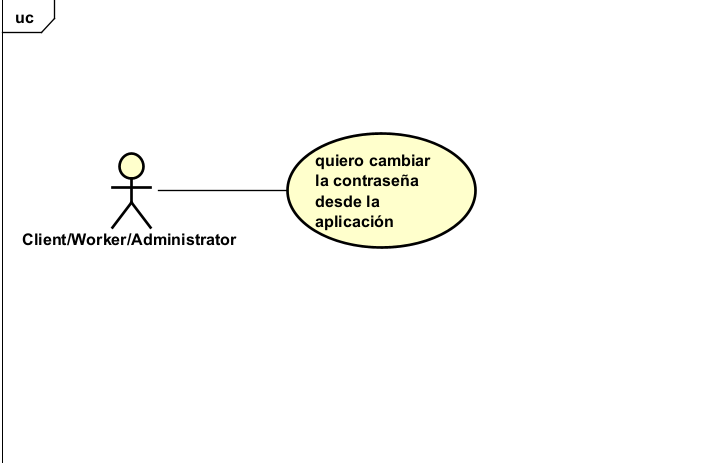
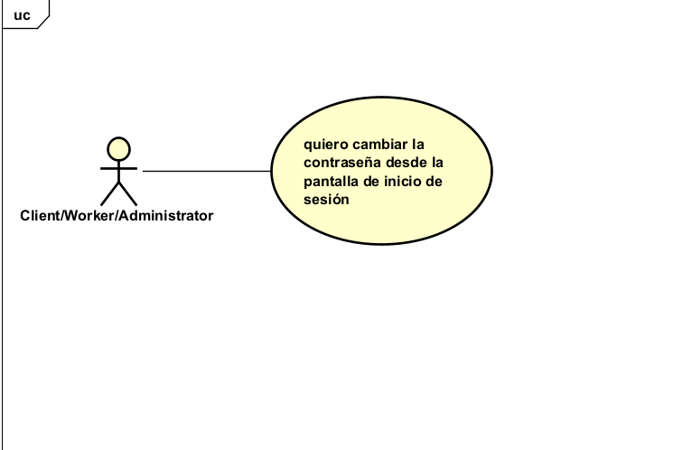
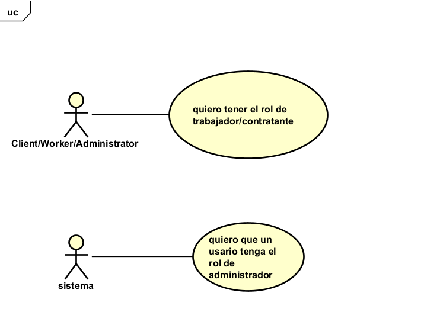
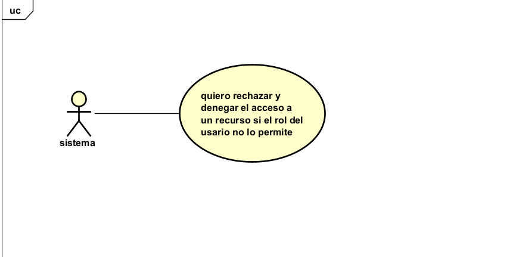
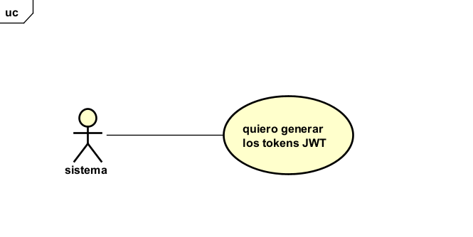

# 📄 Requerimientos del Microservicio

## 1. Lista general de requerimientos

El sistema de OFICIOYA tiene los siguientes requerimientos (descripción a alto nivel):

### 1.1 Requerimientos funcionales

El sistema de OFICIOYA debe tener la capacidad de:

1. El sistema debe permitir el inicio de sesión mediante usuario y contraseña, validando las credenciales contra la información de usuario gestionada por el User domain.

2. El sistema debe rechazar el inicio de sesión con credenciales inválidas o usuario inactivo, devolviendo un mensaje de error apropiado sin filtrar información sensible.

3. El sistema debe aplicar una política de complejidad a las nuevas contraseñas (longitud mínima, combinación de caracteres).

4. El sistema debe permitir a un usuario autenticado cambiar su contraseña, validando previamente su contraseña actual.

5. El sistema debe permitir a un usuario cambiar su contraseña desde la página inicial de oficio ya

6. El sistema debe soportar la asignación de uno o varios roles a un mismo usuario (Client/Worker/Administrator).

7. El sistema debe restringir el acceso a funcionalidades según el rol del usuario autenticado.

8. Al autenticarse correctamente, el sistema debe generar un token JWT que incluya el id del usuario, sus roles y una fecha de expiración.

9. El sistema debe cifrar (hash) cualquier contraseña que gestione (por ejemplo, al actualizarla) antes de persistirla o compararla.

### 1.2 Requerimientos no funcionales

El sistema de OFICIOYA debe tener:

1. Seguridad: toda autenticación debe emitir y validar tokens firmados mediante JWT.

2. Calidad: la cobertura mínima de pruebas unitarias debe ser del 80%.

3. Logging: el servicio debe generar logs estructurados para trazabilidad y debugging.

4. Las contraseñas gestionadas por el servicio deben almacenarse siempre cifradas (hash), nunca en texto plano.

5. Los tokens JWT deben tener un tiempo de expiración definido y deben ser rechazados una vez vencidos (Este tiempo es de 30 minutos).

6. El servicio debe documentar sus APIs (Swagger/OpenAPI) para consumo del Orchestrator y otros squads.

7. El servicio debe responder con mensajes de error genéricos ante credenciales inválidas, sin revelar si el fallo fue por usuario inexistente o contraseña incorrecta (evita enumeración de usuarios).

## 2. Diagramas de caso de uso

### 2.1 Requerimiento Funcional 1

| Campo | Descripción |
|------|-------------|
| **ID** | RF-01 |
| **Nombre del requerimiento** | INICIO DE SESIÓN  |
| **Descripción** | El sistema debe permitir el inicio de sesión mediante usuario y contraseña, validando las credenciales contra la información de usuario gestionada por el User domain. Cada usuario debe ser único, esto se validará por el microservicio USER DOMAIN donde deben validar esto al momento de crearla, la contraseña debe cumplir unos requisitos, si  se cumplen los requisitos , se revisa si la contraseña es la del usuario |
| **Precondiciones** |  1) El usuario ya debe existir en OficioYa, 2) El usuario debe tener una contraseña que cumpla con los requisitos de seguridad estipulados. |
| **Actor** |Client/Worker/Administrator  |
| **Flujo principal** | 1. El usuario ingresa a la aplicación 2. El usuario ingresa sus credenciales (usuario y contraseña) 3. La aplicación revisa si la contraseña ingresada coincide con la contraseña definida en el proceso de registro 4. Se realiza el proceso de autenticación. 5.Si el usuario y contraseña son correctos, se dirige a la pantalla de inicio (_home_) de OficioYa. |
| **Diagrama de caso de uso** |  |
| **Postcondiciones** | Se espera como resultado que el usuario se haya autenticado exitosamente en el sistema, reflejando la información actualizada para todos los usuarios. |

### 2.2 Requerimiento Funcional 2

| Campo | Descripción |
|------|-------------|
| **ID** | RF-02 |
| **Nombre del requerimiento** | Rechazo inicio sesión |
| **Descripción** | El sistema debe rechazar el inicio de sesión si la contraseña de un usuario es incorrecta o si el usuario no existe, si se comprueba que el user no existe, se rechaza, pero si existe se comprueba si la contraseña ingresada cumple con los requisitos, si no cumple se rechaza automaticamente, si se cumple los requisitos se valida si es la contraseña y si no es se rechaza |
| **Precondiciones** | Para que el sistema cumpla con este requerimiento, el user debe tener una cuenta con credenciales válidas (nombre de usuario y contraseña) |
| **Actor** | Sistema|
| **Flujo principal** | 1. El usuario ingresa sus credenciales, tanto usuario como contraseña. 2. El sistema verifica si el usuario existe; si no existe, rechaza el acceso inmediatamente. 3. Si el usuario existe, el sistema revisa si la contraseña ingresada cumple con los requisitos de seguridad; si no los cumple, se rechaza automáticamente. 4. Si la contraseña cumple los requisitos, el sistema valida si corresponde al usuario; si no corresponde, se rechaza el acceso. 5. En cualquier caso de rechazo, el sistema muestra el mensaje de error genérico: *"Usuario o contraseña incorrectos, por favor rectifique sus credenciales."* (el mensaje no revela cuál de los dos datos es el incorrecto). |
| **Diagrama de caso de uso** |  |
| **Postcondiciones** | Se espera como resultado que el usuario esté informado de que sus credenciales son incorrectas y que realice las respectivas correcciones. |

### 2.3 Requerimiento Funcional 3

| Campo | Descripción |
|------|-------------|
| **ID** | RF-03 |
| **Nombre del requerimiento** | Visualización y validación de política de contraseñas |
| **Descripción** | El sistema debe mostrar y validar la política de contraseñas en las pantallas de **registro de usuario** y de **cambio de contraseña**, garantizando que toda contraseña ingresada cumpla con: longitud mínima de 12 caracteres, al menos una mayúscula, al menos un número, al menos un carácter especial y al menos una minúscula. |
| **Precondiciones** | El usuario no se ha registrado previamente **o** el usuario ya está registrado y desea cambiar su contraseña. |
| **Actor** |Client/Worker/Administrator|
| **Flujo principal** | **Escenario A – Registro:** 1. El usuario accede a la pantalla de registro. 2. El sistema muestra en pantalla los requisitos de la política de contraseñas. 3. El usuario ingresa una contraseña. 4. El sistema valida en tiempo real el cumplimiento de los requisitos. 5. Si no cumple, muestra mensaje de error indicando qué requisito falla. 6. Si cumple, habilita continuar con el registro.  **Escenario B – Cambio de contraseña:** 1. El usuario accede a la pantalla de cambio de contraseña. 2. El sistema muestra en pantalla los requisitos de la política de contraseñas. 3. El usuario ingresa la nueva contraseña. 4. El sistema valida que cumpla con los requisitos y que sea distinta a la actual. 5. Si no cumple, muestra mensaje de error indicando qué requisito falla. 6. Si cumple, habilita continuar con el cambio. |
| **Diagrama de caso de uso** |  |
| **Postcondiciones** | La contraseña ingresada cumple con la política de seguridad del sistema y queda lista para ser procesada por el flujo base (RF-01 o RF-04 según corresponda). |

### 2.4 Requerimiento Funcional 4

| Campo | Descripción |
|------|-------------|
| **ID** | RF-04 |
| **Nombre del requerimiento** | Cambio de contraseña — Usuario autenticado |
| **Descripción** | El sistema debe permitir a un usuario autenticado cambiar su contraseña desde la sección **"Mi perfil"**, validando previamente su contraseña actual para comprobar que quien accede a la cuenta es la persona autorizada para hacerlo. |
| **Precondiciones** | 1. El usuario debe tener una cuenta en el sistema. 2. El usuario debe estar autenticado en OficioYa. 3. El usuario debe encontrarse en la sección **"Mi perfil"** → opción **"Cambiar contraseña"**. |
| **Actor** | Client/Worker/Administrator |
| **Flujo principal** | 1. El usuario accede a **"Mi perfil"** desde el menú de navegación de OficioYa. 2. El usuario selecciona la opción **"Cambiar contraseña"**. 3. El usuario ingresa su contraseña actual. 4. El sistema verifica que la contraseña actual sea correcta; si no lo es, muestra el mensaje: *"La contraseña actual ingresada es incorrecta."* 5. El usuario ingresa la nueva contraseña y su confirmación. 6. El sistema valida que la nueva contraseña cumpla con la política de seguridad (RF-03) y que sea distinta a la contraseña actual; si no cumple, muestra el mensaje indicando qué requisito falla. 7. El sistema actualiza la contraseña, cierra la sesión del usuario en todos los dispositivos y muestra el mensaje: *"Tu contraseña ha sido actualizada exitosamente. Por favor inicia sesión nuevamente."* 8. El sistema redirige al usuario a la pantalla de inicio de sesión. |
| **Diagrama de caso de uso** |  |
| **Postcondiciones** | La contraseña queda actualizada en el sistema, todas las sesiones activas son cerradas y el usuario debe iniciar sesión con la nueva contraseña. |

### 2.5 Requerimiento Funcional 5

| Campo | Descripción |
|------|-------------|
| **ID** | RF-05 |
| **Nombre del requerimiento** | Recuperación de contraseña — Usuario no autenticado |
| **Descripción** | El sistema debe permitir a un usuario no autenticado recuperar el acceso a su cuenta desde la **pantalla de inicio de sesión de OficioYa**, mediante el envío de un enlace de recuperación a su correo electrónico registrado. El enlace contiene un token de un solo uso con vigencia de 15 minutos. Al completarse el proceso, se invalidan todas las sesiones JWT existentes del usuario. |
| **Precondiciones** | 1. El usuario debe tener una cuenta registrada en el sistema con un correo electrónico válido. 2. El usuario **no está autenticado** y se encuentra en la **pantalla de inicio de sesión de OficioYa**. |
| **Actor** | Client/Worker/Administrator |
| **Flujo principal** | 1. El usuario selecciona la opción **"¿Olvidaste tu contraseña?"** en la pantalla de inicio de sesión de OficioYa. 2. El usuario ingresa su correo electrónico registrado y envía la solicitud. 3. El sistema verifica si el correo existe; en cualquier caso muestra el mensaje genérico: *"Si el correo está registrado, recibirás un enlace de recuperación en los próximos minutos."* (no revela si el correo existe o no). 4. Si el correo existe, el sistema genera un token de un solo uso con vigencia de 15 minutos y un límite de 3 solicitudes por hora, y envía el enlace de recuperación al correo mediante **Spring Boot Mail**. 5. El usuario accede al enlace desde su correo. 6. El sistema valida que el token sea válido y no haya expirado; si expiró muestra: *"El enlace de recuperación ha expirado. Por favor solicita uno nuevo."* 7. El usuario ingresa y confirma su nueva contraseña. 8. El sistema valida que la nueva contraseña cumpla con la política de seguridad (RF-03); si no cumple, muestra el mensaje indicando qué requisito falla. 9. El sistema actualiza la contraseña, invalida todas las sesiones JWT activas e invalida el token de recuperación. 10. El sistema muestra el mensaje: *"Tu contraseña ha sido actualizada exitosamente."* y redirige al usuario a la pantalla de inicio de sesión. |
| **Diagrama de caso de uso** |  |
| **Postcondiciones** | La contraseña queda actualizada, todas las sesiones JWT existentes son invalidadas y el token de recuperación queda inutilizable. |

### 2.6 Requerimiento Funcional 6

| Campo | Descripción |
|------|-------------|
| **ID** | RF-06 |
| **Nombre del requerimiento** | Asignación de roles |
| **Descripción** | El sistema debe soportar la asignación de uno o varios roles a un mismo usuario (Trabajador, Contratante, Administrador) al momento de ser creado o posteriormente mediante el administrador. Los roles disponibles son: **Trabajador** (ofrece servicios), **Contratante** (solicita servicios) y **Administrador** (gestiona la plataforma, solo asignado por el equipo interno). |
| **Precondiciones** | El usuario debe existir en el dominio de usuarios o estar en proceso de registro. |
| **Actor** | Sistema / Administrador |
| **Flujo principal** | **Escenario A – Usuario nuevo (durante el registro):** 1. El usuario accede a la pantalla de **registro de OficioYa**. 2. El sistema muestra los roles disponibles: **Trabajador** y **Contratante** (el rol Administrador no es seleccionable desde el registro público). 3. El usuario selecciona uno o ambos roles según su necesidad. 4. El usuario hace clic en el botón **"Aceptar"** para confirmar su selección. 5. El sistema asocia los roles seleccionados al ID del usuario en la base de datos. 6. El sistema muestra el mensaje de éxito: *"Roles asignados correctamente. ¡Bienvenido a OficioYa!"* 7. Si la asignación falla, el sistema muestra: *"No fue posible asignar los roles. Por favor inténtelo más tarde."*  **Escenario B – Asignación de rol Administrador (usuario existente):** 1. El equipo interno decide otorgar el rol de Administrador a un usuario de la plataforma. 2. El sistema envía un correo al usuario mediante **Spring Boot Mail** con un enlace de invitación. 3. El usuario abre el correo y hace clic en el botón **"Aceptar invitación"** incluido en el enlace. 4. El sistema redirige al usuario a una pantalla donde puede elegir usar su cuenta existente o crear una nueva. 5. El usuario confirma su elección haciendo clic en **"Confirmar"**. 6. El sistema actualiza el rol del usuario a Administrador en la base de datos y envía un correo de confirmación: *"Tu cuenta ahora tiene rol de Administrador en OficioYa."* 7. Si el enlace expiró o es inválido, el sistema muestra: *"El enlace de invitación no es válido o ha expirado. Contacta al equipo de soporte."* 8. Si la actualización falla, el sistema muestra: *"No fue posible asignar el rol. Por favor inténtelo más tarde."* |
| **Diagrama de caso de uso** |  |
| **Postcondiciones** | El usuario queda con los roles asignados y puede acceder a las funcionalidades que le corresponden según su rol. |

### 2.7 Requerimiento Funcional 7

| Campo | Descripción |
|------|-------------|
| **ID** | RF-07 |
| **Nombre del requerimiento** | Restricción de acceso por rol |
| **Descripción** | El sistema debe restringir el acceso a funcionalidades según el rol del usuario autenticado. |
| **Precondiciones** | El usuario debe estar autenticado y tener al menos un rol asignado en el sistema. |
| **Actor** | Sistema |
| **Flujo principal** | 1. El usuario intenta acceder a una ruta protegida. 2. El orquestador de la aplicación verifica los roles en el token JWT. 3. Si el rol es insuficiente, no debe mostrar la opción al usuario ni permitirle el acceso. 4. Si el rol es correcto, permite la petición y accede al recurso. |
| **Diagrama de caso de uso** |  |
| **Postcondiciones** | El usuario accede al recurso solicitado si su rol es suficiente, o recibe una respuesta de acceso denegado si no lo es. |

### 2.8 Requerimiento Funcional 8

| Campo | Descripción |
|------|-------------|
| **ID** | RF-08 |
| **Nombre del requerimiento** | Generación de token JWT |
| **Descripción** | Al autenticarse correctamente, el sistema debe generar un token JWT que incluya el id del usuario, sus roles y una fecha de expiración. |
| **Precondiciones** | El usuario ha sido autenticado exitosamente por el sistema (RF-01) con credenciales válidas. |
| **Actor** | Sistema |
| **Flujo principal** | 1. Las credenciales del usuario son validadas exitosamente. 2. El sistema construye el token JWT con los siguientes claims: **id del usuario**, **roles asignados** y **fecha de expiración** (30 minutos según RNF-05). 3. El token es firmado con la clave secreta del servidor. 4. El token firmado es enviado al cliente en la respuesta. 5. Si la generación del token falla, el sistema devuelve un error 500 y registra el evento en los logs (RNF-03). |
| **Diagrama de caso de uso** |  |
| **Postcondiciones** | El cliente recibe un token JWT válido y firmado que deberá incluir en las cabeceras de las peticiones subsiguientes para acceder a los recursos protegidos de OficioYa. |
### 2.9 Requerimiento Funcional 9

| Campo | Descripción |
|------|-------------|
| **ID** | RF-09 |
| **Nombre del requerimiento** | Cifrado de contraseñas (Hash) |
| **Descripción** | El sistema debe cifrar (hash) cualquier contraseña que gestione antes de persistirla o compararla. |
| **Precondiciones** | *No aplica (parte integral de RF-01 y RF-03).* |
| **Actor** | Sistema |
| **Flujo principal** | 1. El sistema recibe una contraseña en texto plano. 2. Se aplica la función de hash (ej. bcrypt). 3. La contraseña cifrada se almacena en base de datos o se compara con la existente. |
| **Diagrama de caso de uso** |  |
| **Postcondiciones** | *No aplica.* |

