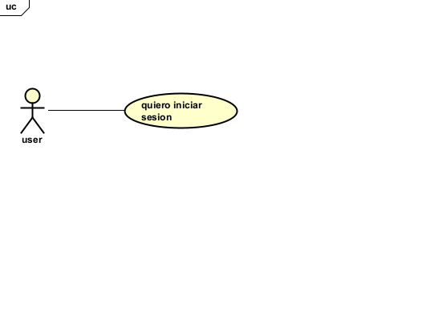
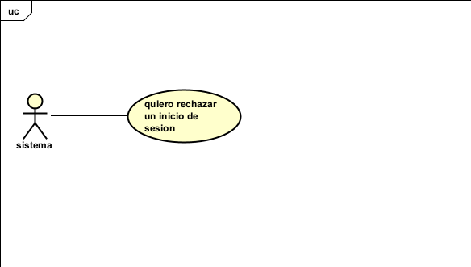
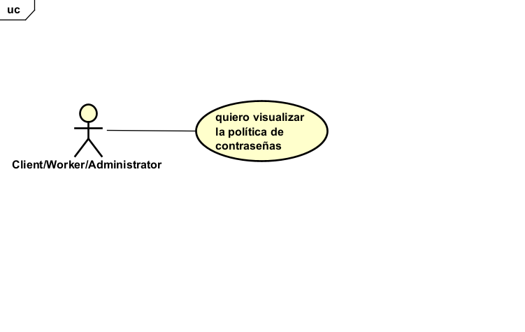

# 📄 Requerimientos del Microservicio

## 1. Lista general de requerimientos

El sistema de OFICIOYA tiene los siguientes requerimientos (descripción a alto nivel):

### 1.1 Requerimientos funcionales

El sistema de OFICIOYA debe tener la capacidad de:

1. El sistema debe permitir el inicio de sesión mediante usuario y contraseña, validando las credenciales contra la información de usuario gestionada por el User domain.

2. El sistema debe rechazar el inicio de sesión con credenciales inválidas o usuario inactivo, devolviendo un mensaje de error apropiado sin filtrar información sensible.

3. El sistema debe aplicar una política de complejidad a las nuevas contraseñas (longitud mínima, combinación de caracteres).

4. El sistema debe permitir a un usuario autenticado cambiar su contraseña, validando previamente su contraseña actual.

5. El sistema debe soportar la asignación de uno o varios roles a un mismo usuario (Client/Worker/Administrator).

6. El sistema debe restringir el acceso a funcionalidades según el rol del usuario autenticado.

7. Al autenticarse correctamente, el sistema debe generar un token JWT que incluya el id del usuario, sus roles y una fecha de expiración.

8. El sistema debe cifrar (hash) cualquier contraseña que gestione (por ejemplo, al actualizarla) antes de persistirla o compararla.

### 1.2 Requerimientos no funcionales

El sistema de OFICIOYA debe tener:

1. Seguridad: toda autenticación debe emitir y validar tokens firmados mediante JWT.

2. Calidad: la cobertura mínima de pruebas unitarias debe ser del 80%.

3. Logging: el servicio debe generar logs estructurados para trazabilidad y debugging.

4. Las contraseñas gestionadas por el servicio deben almacenarse siempre cifradas (hash), nunca en texto plano.

5. Los tokens JWT deben tener un tiempo de expiración definido y deben ser rechazados una vez vencidos (Este tiempo es de 30 minutos).

6. El servicio debe documentar sus APIs (Swagger/OpenAPI) para consumo del Orchestrator y otros squads.

7. El servicio debe responder con mensajes de error genéricos ante credenciales inválidas, sin revelar si el fallo fue por usuario inexistente o contraseña incorrecta (evita enumeración de usuarios).

## 2. Diagramas de caso de uso

### 2.1 Requerimiento Funcional 1

| Campo | Descripción |
|------|-------------|
| **ID** | RF-01 |
| **Nombre del requerimiento** | INICIO DE SESIÓN  |
| **Descripción** | El sistema debe permitir el inicio de sesión mediante usuario y contraseña, validando las credenciales contra la información de usuario gestionada por el User domain. Cada usuario debe ser único, esto se validará por el microservicio USER DOMAIN donde deben validar esto al momento de crearla, la contraseña debe cumplir unos requisitos, si  se cumplen los requisitos , se revisa si la contraseña es la del usuario |
| **Precondiciones** |  1) El usuario ya debe existir en OficioYa, 2) El usuario debe tener una contraseña que cumpla con los requisitos de seguridad estipulados. |
| **Actor** |Client/Worker/Administrator  |
| **Flujo principal** | 1. El usuario ingresa a la aplicación 2. El usuario ingresa sus credenciales (usuario y contraseña) 3. La aplicación revisa si la contraseña ingresada coincide con la contraseña definida en el proceso de registro 4. Se realiza el proceso de autenticación. 5.Si el usuario y contraseña son correctos, se dirige a la pantalla de inicio (_home_) de OficioYa. |
| **Diagrama de caso de uso** |  |
| **Postcondiciones** | Se espera como resultado que el usuario se haya autenticado exitosamente en el sistema, reflejando la información actualizada para todos los usuarios. |

### 2.2 Requerimiento Funcional 2

| Campo | Descripción |
|------|-------------|
| **ID** | RF-02 |
| **Nombre del requerimiento** | Rechazo inicio sesión |
| **Descripción** | El sistema debe rechazar el inicio de sesión si la contraseña de un usuario es incorrecta o si el usuario no existe, si se comprueba que el user no existe, se rechaza, pero si existe se comprueba si la contraseña ingresada cumple con los requisitos, si no cumple se rechaza automaticamente, si se cumple los requisitos se valida si es la contraseña y si no es se rechaza |
| **Precondiciones** | Para que el sistema cumpla con este requerimiento, el user debe tener una cuenta con credenciales válidas (nombre de usuario y contraseña) |
| **Actor** | Sistema|
| **Flujo principal** | 1. El usuario ingresa sus credenciales, tanto usuario como contraseña. 2. El sistema verifica si el usuario existe; si no existe, rechaza el acceso inmediatamente. 3. Si el usuario existe, el sistema revisa si la contraseña ingresada cumple con los requisitos de seguridad; si no los cumple, se rechaza automáticamente. 4. Si la contraseña cumple los requisitos, el sistema valida si corresponde al usuario; si no corresponde, se rechaza el acceso. 5. En cualquier caso de rechazo, el sistema muestra el mensaje de error genérico: *"Usuario o contraseña incorrectos, por favor rectifique sus credenciales."* (el mensaje no revela cuál de los dos datos es el incorrecto). |
| **Diagrama de caso de uso** |  |
| **Postcondiciones** | Se espera como resultado que el usuario esté informado de que sus credenciales son incorrectas y que realice las respectivas correcciones. |

### 2.3 Requerimiento Funcional 3

| Campo | Descripción |
|------|-------------|
| **ID** | RF-03 |
| **Nombre del requerimiento** | Visualización y validación de política de contraseñas |
| **Descripción** | El sistema debe mostrar y validar la política de contraseñas en las pantallas de **registro de usuario** y de **cambio de contraseña**, garantizando que toda contraseña ingresada cumpla con: longitud mínima de 12 caracteres, al menos una mayúscula, al menos un número, al menos un carácter especial y al menos una minúscula. |
| **Precondiciones** | El usuario no se ha registrado previamente **o** el usuario ya está registrado y desea cambiar su contraseña. |
| **Actor** |Client/Worker/Administrator|
| **Flujo principal** | **Escenario A – Registro:** 1. El usuario accede a la pantalla de registro. 2. El sistema muestra en pantalla los requisitos de la política de contraseñas. 3. El usuario ingresa una contraseña. 4. El sistema valida en tiempo real el cumplimiento de los requisitos. 5. Si no cumple, muestra mensaje de error indicando qué requisito falla. 6. Si cumple, habilita continuar con el registro.  **Escenario B – Cambio de contraseña:** 1. El usuario accede a la pantalla de cambio de contraseña. 2. El sistema muestra en pantalla los requisitos de la política de contraseñas. 3. El usuario ingresa la nueva contraseña. 4. El sistema valida que cumpla con los requisitos y que sea distinta a la actual. 5. Si no cumple, muestra mensaje de error indicando qué requisito falla. 6. Si cumple, habilita continuar con el cambio. |
| **Diagrama de caso de uso** |  |
| **Postcondiciones** | La contraseña ingresada cumple con la política de seguridad del sistema y queda lista para ser procesada por el flujo base (RF-01 o RF-04 según corresponda). |

### 2.4 Requerimiento Funcional 4

| Campo | Descripción |
|------|-------------|
| **ID** | RF-04|
| **Nombre del requerimiento** | Cambio de contraseña |
| **Descripción** | El sistema debe permitir a un usuario autenticado cambiar su contraseña, validando previamente su contraseña actual o que se realice otro proceso de autenticación , y que la nueva contraseña cumpla con los requisitos de seguridad establecidos y que sea distinta a la contraseña actual, ayudandonos con el microservicio USER Domain. |
| **Precondiciones** | El usuario debe tener una cuenta en el sistema, con su respectivo user y password. |
| **Actor** | Usuario |
| **Flujo principal** | 1. El usuario accede a la opción de cambio de contraseña. 2. si el usuario desea primero cambiar la contraseña ya autenticado , ingresa su contraseña actual yluego la nueva contraseña que debe cumplir con los requisitos de seguridad. 3. si el usuario desea cambiar la contraseña sin autenticarse primero , podra realizar otro proceso de autenticación el cual consiste en mandarle un codigo de seguridad por sms al celular registrado . 4. El sistema valida la contraseña nueva y si cumple con los requisitos , actualiza la contraseña y notifica el éxito de la operación. |
| **Diagrama de caso de uso** |  |
| **Postcondiciones** | La contraseña se actualiza en el sistema y será requerida para el próximo inicio de sesión. |

### 2.5 Requerimiento Funcional 5

| Campo | Descripción |
|------|-------------|
| **ID** | RF-05 |
| **Nombre del requerimiento** | Asignación de roles |
| **Descripción** | El sistema debe soportar la asignación de uno o varios roles a un mismo usuario (Trabajador,Contratante, Administrador). |
| **Precondiciones** | El usuario debe existir en el dominio de usuarios. |
| **Actor** | Sistema / Administrador |
| **Flujo principal** | 1.1. Se registra un nuevo usuario . 1.2. Se le asignan los roles al usuario nuevo (puede ser trabajador y/o contratante). 1.3. El sistema asocia los roles seleccionados al ID del usuario en la base de datos. |
| **Diagrama de caso de uso** |  |
| **Postcondiciones** | El usuario queda con los roles asignados, lo cual definirá sus permisos de acceso. |

### 2.6 Requerimiento Funcional 6

| Campo | Descripción |
|------|-------------|
| **ID** | RF-06 |
| **Nombre del requerimiento** | Restricción de acceso por rol |
| **Descripción** | El sistema debe restringir el acceso a funcionalidades según el rol del usuario autenticado. |
| **Precondiciones** | *No aplica (se apoya en la lógica de asignación de roles de RF-05 y el token de RF-07).* |
| **Actor** | Sistema |
| **Flujo principal** | 1. El usuario intenta acceder a una ruta protegida. 2. El sistema (API Gateway) verifica los roles en el token JWT. 3. Si el rol es insuficiente, rechaza la petición (403 Forbidden). 4. Si es correcto, permite la petición. |
| **Diagrama de caso de uso** |  |
| **Postcondiciones** | el usuario accede a la ruta  |

### 2.7 Requerimiento Funcional 7

| Campo | Descripción |
|------|-------------|
| **ID** | RF-07 |
| **Nombre del requerimiento** | Generación de token JWT |
| **Descripción** | Al autenticarse correctamente, el sistema debe generar un token JWT que incluya el id del usuario, sus roles y una fecha de expiración. |
| **Precondiciones** | *No aplica (se activa automáticamente tras la precondición de éxito de RF-01).* |
| **Actor** | Sistema |
| **Flujo principal** | 1. Credenciales validadas exitosamente. 2. El sistema crea el token JWT con los claims correspondientes. 3. El token es firmado y enviado al cliente en la respuesta. |
| **Diagrama de caso de uso** |  |
| **Postcondiciones** 
### 2.8 Requerimiento Funcional 8

| Campo | Descripción |
|------|-------------|
| **ID** | RF-08 |
| **Nombre del requerimiento** | Cifrado de contraseñas (Hash) |
| **Descripción** | El sistema debe cifrar (hash) cualquier contraseña que gestione antes de persistirla o compararla. |
| **Precondiciones** | *No aplica (parte integral de RF-01 y RF-03).* |
| **Actor** | Sistema |
| **Flujo principal** | 1. El sistema recibe una contraseña en texto plano. 2. Se aplica la función de hash (ej. bcrypt). 3. La contraseña cifrada se almacena en base de datos o se compara con la existente. |
| **Diagrama de caso de uso** |  |
| **Postcondiciones** | *No aplica.* |

